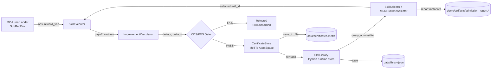

# Full Simplex Integration Report

This report documents the current SubRep integration path for MO-LunarLander:
environment execution, baseline-relative improvement computation, CDS/PDS
certification, MeTTa certificate storage, SkillLibrary admission, MDN-based
selection, and admission reporting.

## 1. Architecture Diagram



## 2. Random Policy Rejection Check

This run validated the negative path: unsafe skills are rejected and do not enter
the library.

Generated by:

```bash
python -m demo.run_full_pipeline
```

| Metric | Value |
|---|---:|
| Total Episodes | 10 |
| Admitted | 0 |
| Rejected | 10 |
| Library Size | 0 |
| Baseline Episodes | 20 |
| Baseline Mean Payoff | 28.29 |

Representative rejected row:

| Episode | Payoff | delta_r | min(delta_n) | CDS | PDS | Result |
|---:|---:|---:|---:|---|---|---|
| 1 | -9.588 | -37.880 | -55.097 | N | N | Rejected |

Interpretation:

- The random policy produced negative improvement margins.
- CDS failed because `delta_r + min(delta_n) < 0`.
- PDS also failed because the deficit exceeded the epsilon budget.
- `CertificateStore` and `SkillLibrary` stayed synchronized at size `0`.

This validates the rejection path and confirms that unsafe skills are not stored.

## 3. Trained PPO Pilot Admission Check

After integrating the trained PPO pilot, the same certificate path admits
high-quality skills.

Generated by:

```bash
python -m demo.run_full_pipeline
```

| Metric | Random Policy Run | Trained PPO Pilot Run |
|---|---:|---:|
| Admission Rate | 0% (0/10) | 100% (10/10) |
| Mean Payoff | -43.6 | +158.9 |
| Library Size | 0 | 10 |
| First Admission | N/A | Episode 1 |

Representative trained-pilot rows:

| Ep | Search | Payoff | delta_r | min(delta_n) | CDS | PDS | Result | Lib |
|---:|---:|---:|---:|---:|---|---|---|---:|
| 1 | 27 | 164.750 | 186.004 | 58.805 | Y | Y | Admitted | 1 |
| 2 | 27 | 156.463 | 177.717 | 59.839 | Y | Y | Admitted | 2 |
| 5 | 5 | 183.008 | 204.262 | 57.416 | Y | Y | Admitted | 5 |
| 10 | 8 | 147.083 | 168.337 | 59.734 | Y | Y | Admitted | 10 |

Interpretation:

- The trained pilot improves both payoff and motives relative to the idle baseline.
- All admitted skills pass the strict CDS condition.
- The store/library invariant holds: `cert_store.count() == library.count()`.
- Rejected skills still cannot enter the library because `add_skill()` re-checks certificate math.

## 4. MDN Integration

The MDN path is implemented and connected to runtime selection.

Implemented pieces:

- `generator/mdn.py`: alpha, support, gate, and Q heads.
- `data_collector/collect_candidate_sets.py`: same-context candidate outcome collection.
- `generator/train_mdn_candidate_sets.py`: policy and auxiliary MDN training.
- `generator/evaluate_mdn_candidate_sets.py`: held-out candidate-set evaluation.
- `generator/mdn_runtime_selector.py`: checkpoint-backed runtime selection.
- `library/skill_selector.py`: `select_by_mdn()` path.
- `utils/mdn_checkpoint_loader.py`: shape-inferred checkpoint loading.
- `utils/mdn_stub.py`: fallback for tests and smoke runs when a checkpoint is unavailable.

The runtime selection path is:

```text
MDN.forward_inference(context)
  -> alpha, support_values
alpha_to_mean_weights(alpha)
  -> current_weight
SkillLibrary.query_admissible(current_weight, support_directions, support_values)
  -> admissible skills
select_best_skill_entry(admissible, current_weight)
  -> selected skill
```

The trained MDN checkpoint path is:

```text
models/mdn_policy_best.pth
```

If the checkpoint is present, the pipeline records `mdn_source: trained_checkpoint`.
If it is missing, the pipeline records `mdn_source: stub` and uses fixed test
outputs so the demo remains runnable.

## 5. Candidate-Set MDN Training

Recommended training configuration:

```bash
python -m generator.train_mdn_candidate_sets \
  --data-dir data/mdn_candidate_sets \
  --pattern "*.npz" \
  --seed 42 \
  --device cpu \
  --policy-checkpoint models/mdn_policy_best.pth \
  --auxiliary-checkpoint models/mdn_auxiliary_best.pth \
  --q-loss mse
```

Final training setup:

- training data: 21,000 candidate outcomes from 3,000 contexts,
- final Q loss: MSE,
- Q target normalization: enabled,
- affine Q calibration: available but disabled by default,
- Huber Q loss: available but not used in the final configuration,
- IPS/DR support: implemented for future off-policy logged-data settings, but not used for the final candidate-set checkpoint.

## 6. Held-Out MDN Evaluation

Held-out evaluation uses unseen candidate-set seeds and reports selection and
auxiliary-head quality.

Reference validation after the 2-objective support-geometry fix:

| Metric | Mean |
|---|---:|
| Lift vs always-PPO | +9.54 |
| Lift vs random certified | +49.34 |
| Balanced top-1 accuracy | 0.989 |
| Gate F1 | 0.900 |
| Q/motive MSE | 601.65 |
| Q/motive MAE | 13.37 |

The evaluator also reports balanced regret, bootstrap confidence intervals,
per-objective Q MSE/MAE, and support/checkpoint metadata.

## 7. Admission Report

The demo writes:

```text
demo/artifacts/admission_report.json
demo/artifacts/admission_report.md
```

The report includes:

- attempted/admitted/rejected counts,
- CDS and PDS counts,
- failure reasons for rejected skills,
- example admitted/rejected records,
- MDN source metadata,
- alpha, derived weights, support values, and support feasibility.

For final trained-MDN reporting, regenerate the report with
`models/mdn_policy_best.pth` present.

## 8. Safety Guarantees Verified

- Rejected skills are not added to `SkillLibrary`.
- `CertificateStore` and `SkillLibrary` remain synchronized.
- Skill identity must match certificate identity.
- `SkillLibrary.add_skill()` re-validates CDS/PDS math before admission.
- `FULL_SIMPLEX` skills are globally reusable under valid simplex weights.
- `MDN_WX` skills require feasible current support geometry.
- Infeasible MDN support values exclude contextual skills while preserving globally certified skills.

## 9. Test Coverage

Relevant tests include:

| Test File | Coverage |
|---|---|
| `tests/test_certification_gates.py` | CDS/PDS gate logic |
| `tests/test_certificate_storage.py` | MeTTa atom storage and retrieval |
| `tests/test_skill_library.py` | Runtime library admission/query behavior |
| `tests/test_mdn.py` | MDN output contracts and support feasibility |
| `tests/test_mdn_skill_selection.py` | MDN-guided library selection |
| `tests/test_train_mdn_candidate_sets.py` | Candidate-set training behavior |
| `tests/test_evaluate_mdn_candidate_sets.py` | Held-out MDN evaluation metrics |
| `tests/test_trained_mdn_zero_shot.py` | Checkpoint-backed zero-shot path |
| `tests/test_end_to_end_pipeline.py` | Full demo pipeline invariants |

Latest full local validation:

```text
435 passed, 53 warnings
```

## 10. Current Scope

Implemented:

- 2-objective MO-LunarLander SubRep pipeline,
- full-simplex certification,
- 2D contextual `MDN_WX` support geometry,
- MeTTa certificate storage,
- candidate-set MDN training/evaluation,
- zero-shot reuse validation.

Outside the current implementation scope:

- Minecraft environment integration,
- AIRIS rule-sequence integration,
- PLN reasoning integration,
- MetaMo motivational dynamics,
- higher-dimensional `W_x` polytope solver,
- production artifact registry and runtime monitoring.
